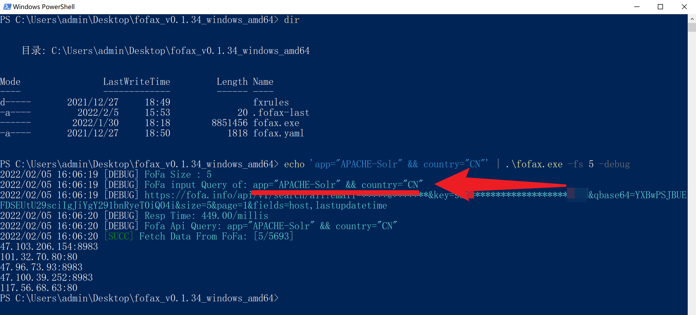
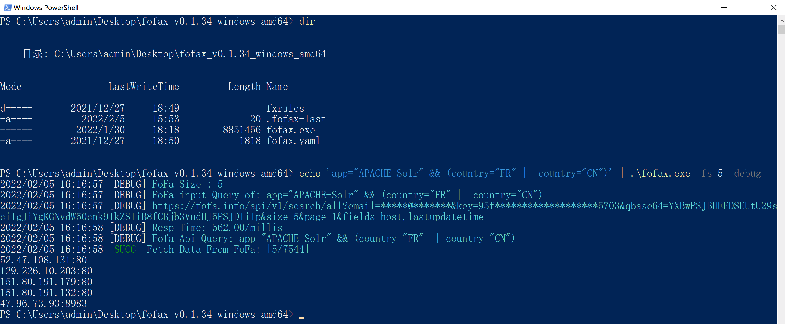
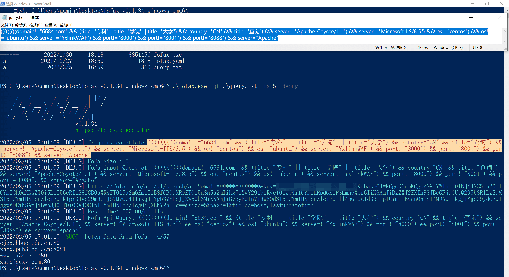

# FAQ

## 读取顺序和生成配置文件的目录

### Windows

Windows 系统下，首次运行 `fofax.exe`，会在当前同级目录下生成配置文件 `fofax.yaml` 和 Fx 规则配置文件 `fxrules` 文件夹。同级目录下的配置文件优先读取。

如果同级目录下没有配置文件，则会去读取用户家目录下的 `.config/fofax/` 目录中的配置文件：


### Linux/macOS

类 Unix 系统，在首次运行 `fofax` 的时候，会在位于 `~/.config/fofax/` 目录生成配置文件。

```shell
fofax

      ____        ____       _  __
     / __/____   / __/____ _| |/ /
    / /_ / __ \ / /_ / __ `/|   /
   / __// /_/ // __// /_/ //   |
  /_/   \____//_/   \__,_//_/|_|
                              
                         fofax.xiecat.fun

2021/12/23 21:21:28 [SUCC] create config file /Users/user/.config/fofax/fofax.yaml. please modify and use
```

## Windows 系统的使用问题

### 通过管道查询

Windows上通过管道进行查询，这种方式是**优先推荐**使用的，因为无需任何转义。

```cmd
echo app="APACHE-Solr" | fofax.exe -fs 3
```


```powershell
echo 'app="APACHE-Solr"' | fofax.exe -fs 5
```


### 通过参数指定查询

在 Windows 下使用一定要注意转义，Windows 终端中输入 `"` 不加转义会消失，所以这种查询方式**稍显麻烦**。

```shell
fofax.exe -q 'app="APACHE-Solr"' 		# 输入的内容
FoFa input Query of: app=Grafana 		#程序实际接收的内容
```

解决这个问题需要转义，可以添加 `-debug` 开启详细调试模式。并且在 Windows 系统上，使用不同的终端软件，命令也是有所不同。

在CMD终端上，`-q` 后面不可以添加单引号 `'`。

```cmd
fofax.exe -q app=\"APACHE-Solr\" -fs 5
```


而在 PowerShell 上，`-q` 后面不仅需要添加单引号，而且对于双引号也要进行转义。

```powershell
fofax.exe -q 'app=\"APACHE-Solr\"' -fs 5
```


### 复杂的查询

当查询语句中存在一些特殊符号（例如 `&` 或者 `|`），此时在原生 CMD 终端中无法完成正常的查询。但在 PowerShell 中可以通过管道正常查询。

```powershell
echo 'app="APACHE-Solr" && country="CN"' | .\fofax.exe -fs 5
```



```powershell
echo 'app="APACHE-Solr" && (country="FR" || country="CN")' | .\fofax.exe -fs 5
```



除此之外，如果有更复杂的查询语句，可以考虑使用文本查询的方式。

```powershell
.\fofax.exe -qf .\query.txt -fs 5
```



## 提示语法错误

```bash
./fofax -q fx="redis-unauth"

2021/12/30 19:53:47 [INFO] Please add the -fe parameter to use the fofa extended syntax
2021/12/30 19:53:47 [ERRO] FoFa Response ErrMsg: 查询语法错误
```

一般有两种犯错情况。第一种是使用 Fx 语句未加 `-fe` 参数；第二种自己写的语句有问题，可以添加 `-open` 参数到 FoFa 网站上看看。

## Debug 信息

### 查看 Debug 信息

```bash
fofax -q 'app="Grafana"' -debug
2021/12/30 19:49:04 [DEBUG] FoFa Size : 100
2021/12/30 19:49:04 [DEBUG] FoFa input Query of: app=Grafana   ## 程序输入的
2021/12/30 19:49:04 [DEBUG] https://fofa.so/api/v1/search/all?email=*****@*******&key=*******************&qbase64=YXBwPUdyYWZhbmE=&size=100&page=1&fields=host,title,lastupdatetime
2021/12/30 19:49:04 [DEBUG] Resp Time: 314.000000/millis
2021/12/30 19:49:04 [DEBUG] Fofa Api Query: app=Grafana   ## fofa api返回的语句
2021/12/30 19:49:04 [SUCC] Fetch Data From FoFa: [0/0]
```
::: warning
如果想复制完整链接，可以加 `-sp` 参数来显示 `email` 和 `key`。
:::

### 查看语句语法树

```
./fofax -q app="Grafana" -fe -tree

Source:  app=Grafana
Parse:
2021/12/30 19:52:23 [INFO] Source: app=Grafana
2021/12/30 19:52:23 [INFO] Parse: app=Grafana
2021/12/30 19:52:23 [INFO] Tree: (start (query (fofaKeyword app) = (fofaValue Grafana)))
```
