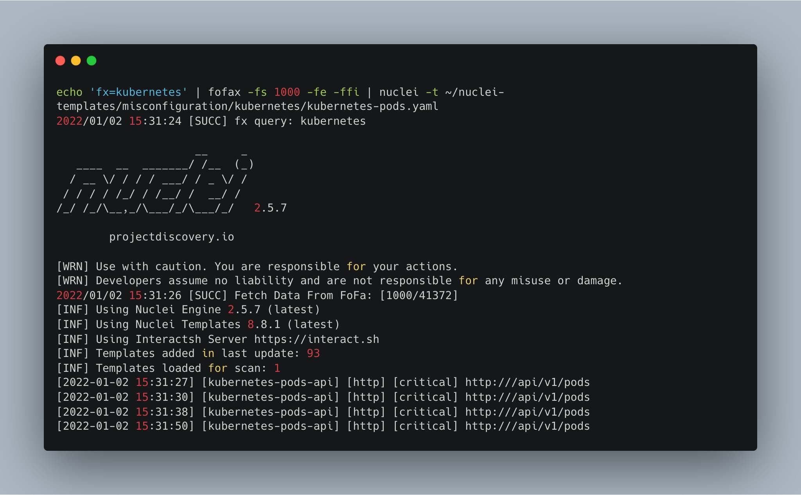
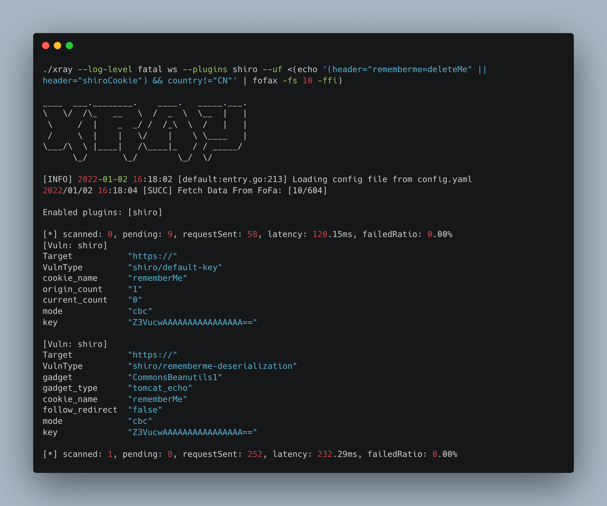
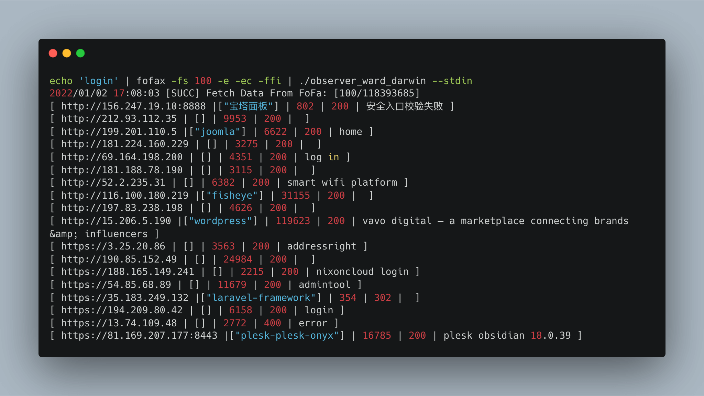
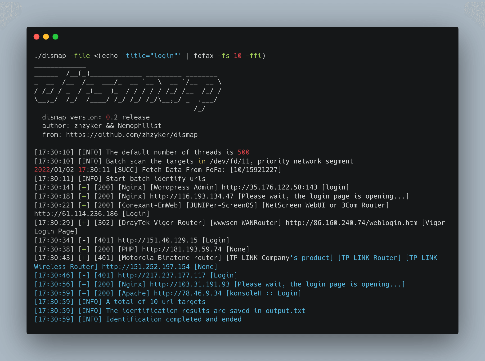

# 目前收集的联动工具

欢迎大家来提供联动案例。

## [httpx](https://github.com/projectdiscovery/httpx)

```shell
fofax -q 'title="Apache APISIX Dashboard"' -ffi | httpx -path "/apisix/admin/migrate/export" -status-code -mc 200 -ms '{"Counsumers":[],"Routes'
```


## [nuclei](https://github.com/projectdiscovery/nuclei)

```shell
echo 'app="kubernetes"' | fofax | httpx | nuclei -t ~/nuclei-templates/misconfiguration/kubernetes/kubernetes-pods.yaml
```

```shell
fofax -q 'fx=kubernetes' -fe | httpx | nuclei -t ~/nuclei-templates/misconfiguration/kubernetes/kubernetes-pods.yaml
```

```shell
echo 'fx=kubernetes' | fofax  -fe | httpx | nuclei -t ~/nuclei-templates/misconfiguration/kubernetes/kubernetes-pods.yaml
```

```shell
echo 'fx=kubernetes' | fofax  -fe  -ffi | nuclei -t ~/nuclei-templates/misconfiguration/kubernetes/kubernetes-pods.yaml
```



## [xray](https://github.com/chaitin/xray)

> 感谢@荋丶 、@becivells两位师傅提供。
```shell
echo 'header="rememberme=deleteMe" || header="shiroCookie"' | fofax -fs 100 -e -ec | httpx -o shiro.txt && xray ws ss --uf shiro.txt
```
```shell 
./xray --log-level fatal ws --plugins shiro --uf <(echo 'header="rememberme=deleteMe" || header="shiroCookie"' | fofax -fs 10 -ffi -ec )
```

## [observer_ward](https://github.com/0x727/ObserverWard_0x727)

> 感谢[@0x727](https://github.com/0x727)开源团队提供。

```shell
echo 'login' | fofax -fs 100  -ec -ffi | ./observer_ward_darwin --stdin
```


## [dismap](https://github.com/zhzyker/dismap/)

```shell
dismap -file <(fofax -q "fx=flash-phishing" -fe|httpx)
```


